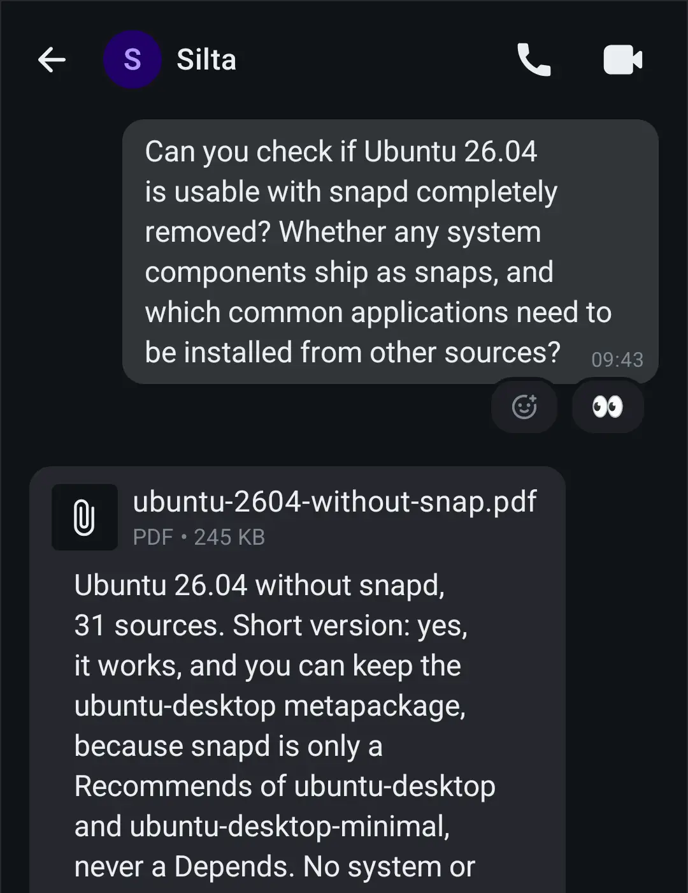
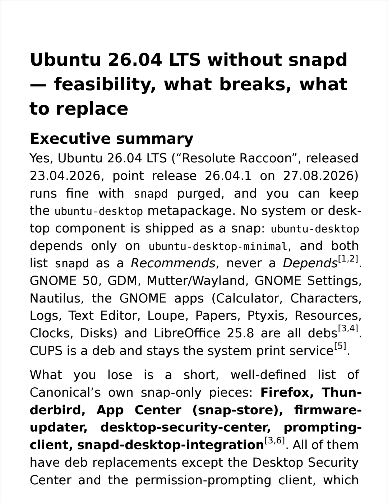

# Silta

[](#license) [](https://crates.io/crates/silta)

Family AI assistant that runs on Claude Code and speaks Matrix. Keeps its memory and the thread of a conversation across context limits, so it always stays the same assistant.

<p align="center">
  
  &nbsp;&nbsp;&nbsp;
  
</p>

## Features

1. Claude Code as the harness: one long-lived session per person, plus a shared session for the family rooms. Each person uses their own Claude subscription (via `claude setup-token`) or Anthropic API key.
2. Remembers people, tasks, and conversation state across context limits and restarts.
3. Direct & group Matrix rooms with read receipts, typing indicators, reactions, attachments, quoting, and threads.
4. Web search & research, with results delivered as PDFs (including phone-sized rendering).
5. Periodic & scheduled tasks.

## Security

1. Claude Code's bubblewrap sandbox to protect the API token and the harness's own state from the agent. Outbound network requests go through a filtering proxy (pass-through by default), and Write/Edit deny rules keep the agent out of the harness configuration.
2. A separate Linux user per session with systemd hardening isolates sessions from the VM and from each other. User namespaces are, unfortunately, allowed for the bubblewrap sandbox to work.
3. Designed to run in a dedicated VM as a natural security boundary from the host.

## Privacy

1. Matrix IDs of the users and of the assistant are not intentionally forwarded to the agent (user names from the config are used instead to identify people), but can reach the context through side channels. Mentions in the rooms and error messages from Matrix SDK returned as tool call errors might carry real user IDs.
2. The agent sees real room IDs, including the homeserver's server name for rooms older than version 12. The server's name and URL might still reach the context via tool call errors coming from Matrix SDK.
3. No user or assistant messages reach the journal log, but message sizes and attachment filenames are logged.

## Architecture overview

The component responsible for Matrix communications is `siltad`. It is the assistant's Matrix device: it logs into the assistant's account and holds end-to-end encryption keys for the rooms it joins.

User messages are delivered by `siltad` over a Unix socket to `silta-claude`, the Claude Code channel plugin that injects the messages into the session and provides MCP tools to the agent to interact with Matrix rooms.

Every Claude Code instance is run by `silta-session`, a session supervisor that manages the Claude Code session's lifecycle. There is one supervisor and session per person and one for the shared rooms.

```
Matrix clients ◀─────▶ Matrix homeserver
                               ▲
                               │  Matrix client-server API, E2EE
                               ▼
                ┌────────────────────────────┐
                │ siltad                     │
                │ the assistant's Matrix     │
                │ device: login, keys, rooms │
                └────────────────────────────┘
                      ▲               ▲
                      │               └──────────┐   Unix sockets
                      │                          │
     ┌────────────────┴─────┐   ┌────────────────┴─────┐
     │ silta-session (Alice)│   │ silta-session (hub)  │  One supervisor per
     │ ┌──────────────┬───┐ │   │ ┌──────────────┬───┐ │  person and one for
     │ │ Claude Code  ▼   │ │   │ │ Claude Code  ▼   │ │  the shared rooms.
     │ │ + silta-claude   │ │   │ │ + silta-claude   │ │
     │ │   channel plugin │ │   │ │   channel plugin │ │
     │ └──────────────────┘ │   │ └──────────────────┘ │
     │ memory, workspace    │   │ memory, workspace    │
     └──────────────────────┘   └──────────────────────┘
```

## Context compaction and continuity

One of the goals of the project is delivering interaction with the assistant without noticeable session edges. This is implemented using three layers:

1. The assistant maintains memory notes and project files that are persisted across session compactions.
2. Once the session's context grows past the threshold (300k tokens by default) and no user messages have arrived for 4 hours (by default), the supervisor sends the agent a host line asking it to prepare for compaction: update the memory notes and write a `handoff.md` note about work in progress.
3. Once the agent ends its turn with the handoff written, the supervisor triggers a compaction designed for an assistant's session: who the assistant and the people are, the distant past as a high-level overview (memory and project files cover the gaps), a more detailed summary of recent work, and the last 100 to 120 messages verbatim. The summary is written by the assistant itself, in its own voice, not by a generic prompt.

This allows the assistant to continue from the point where it was before the compaction, fetching additional facts from memory as it needs them.

## Non-goals

1. Implementing yet another harness.
2. Giving the assistant access to personal services and files on the user's main PC. The idea is that it is a conversation partner that helps with everyday questions and decisions, conducts web research, and can monitor or research something on schedule.

## Project status

Used daily by the author, his family, and friends since 7 September 2026. Built with Claude Code and the assistant itself. Expect things to break (and get fixed).

## Known issues

1. Claude Code evolves fast, breaking the integration. An automatic tool for checking the contract surface is planned.
2. A running `Monitor` task blocks the graceful stop, so the supervisor waits out its timeout and restarts the session before compaction. Session continuity is unaffected.
3. Support for third-party gateways (like OpenRouter) is implemented, but effectively dormant until Anthropic extends the Claude Code channels beta to them.
4. Some sites block web fetch requests coming from datacenter IPs, making the research less efficient. Such sites are in the minority, and this can be worked around by using a residential IP for the network egress of the VM or session's Linux user.

## Deployment

See [docs/deployment.md](docs/deployment.md).

## License

Licensed under either the Apache License 2.0 or the MIT license, at your option (`Apache-2.0 OR MIT`; see [LICENSE-APACHE](LICENSE-APACHE) and [LICENSE-MIT](LICENSE-MIT)).
Contributions are accepted under the same terms, without additional terms or conditions.
